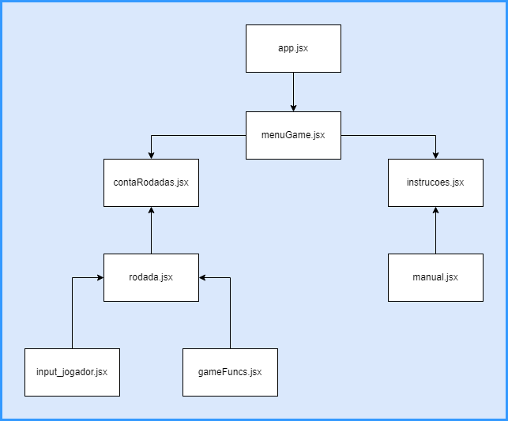

# Relatório técnico - GRUPO C - Jogo Trie2Mem
## Integrantes:
- Gabriel Oliveira
- Daniel Nunes
- Roniclay Rodrigues
- Arthur Franklin

> Link para jogar o jogo: [Clique aqui!](https://trie2mem.netlify.app/)

> Vídeo de teste do jogo: [Clique aqui!](https://youtu.be/De1CXug5m3k)

> Vídeo aspectos técnicos: [Clique aqui!](https://youtu.be/FXrVhwf9vBI)

## Sobre o Jogo
O Trie2Mem possui um design responsivo, o mesmo pode ser acessado em computadores com diferentes resoluções e em (alguns) dispositivos móveis.

O manual do jogo pode ser acessado diretamente pelo jogo ou navegando até o seguinte diretório do repositório:
*src\components\instrucoes\manual.md*.

O jogo será destrinchado nos seguintes tópicos:
- Tecnologias usadas
- Estruturas de dados usadas
- Estruturação do jogo
- Componente playMusic
- Componente input
- Classe Rodadas
- Componente rodada
  

>## Tecnologias usadas
Para a elaboração do projeto, escolheu-se o HTML, CSS, Javascript e React como ferramentas de desenvolvimento.

Sendo uma biblioteca javascript voltada para o desenvolvimento de interfaces de usuário para aplicações web, o React se mostrou extremamente eficiente e útil para o projeto. Uma vez que os componentes do react se tornaram as telas do jogo.
  

>## Estruturas de dados usadas
Foram usadas as seguintes estruturas no projeto:

-<u>Trie</u>:
    Já que é possível buscar palavras de maneira rápida e eficiente dentro de uma trie, ela foi escolhida para armazenar as palavras sorteadas para a rodada atual. Com isso, é possível executar a busca das palavras digitadas pelo jogador na trie rapidamente.

-<u>Stack</u>:
    Por ser uma estrutura simples, de fácil inserção e remoção, foi usada para armazenar as palavras digitadas pelo jogador.

-<u>Array</u>:
    Por ser uma estrutura genérica, foi usada para armazenar alguns dados. Uma vez que operações como adição, remoção ou busca não precisavam ser feitas.
  

>## Estruturação do jogo
O jogo foi estruturado utilizando os componentes do React, que são fragmentos de códigos em HTML que podem ser retornados para uma determinada parte da página, funcionando como uma espécie de tag HTML personalizada.

De forma resumida, a comunicação entre os componentes pode ser ilustrada da seguinte forma:

O componente `playMusic.jsx` não foi inserido no diagrama pois ele é renderizado paralelamente ao componente app.jsx.

O jogo em si fica concentrado no `rodada.jsx`, é lá que o objeto da classe Rodadas é instanciado. Logo, é em rodadas que todos os métodos associados a esse objeto são executados e seus atributos exibidos nas telas da rodada.
  

>## Componente playMusic
Este componente tem como funcionalidade implementar um player simples de música. Foi escolhido uma faixa de 3h de duração com várias músicas de um estilo musical chamado *Lo-Fi*. São músicas simples e relaxantes, agradáveis de serem ouvidas durante a gameplay.
O player tem apenas a função de play/pause e, a cada play, a faixa é resetada em uma posição aletória. Com isso, o jogador sempre começa a ouvir a setlist a partir de uma música diferente, evitando a repetição.
  

>## Componente input
A classe NameForm é a responsável pela coleta do input, sua construção tem como atributos o estado do valor, 
a criação do Stack, e dois métodos, handleChange e handleSubmit. Na renderização do componente temos a div contendo 
o *form* responsável pela criação do formulário, nele temos o input que guarda o valor digitado pelo usuário utilizando o evento
onChange. Esse evento vai chamar o método handleChange responsável pela atribuição do estado do input, após a confirmação 
do envio, o método handleSubmit é chamado, dessa forma, ele coleta o valor digitado pelo usuário, adiciona na Stack, passa o valor 
para o método inputJogador e faz a vericação do tamanho da stack.
  

>## Classe Rodadas
No código fonte, através de classes, foram implementadas as TADs pilha e trie para que os dados utilizados no projeto fossem trabalhados de maneira mais eficiente. 

Em meio ao desenvolvimento do jogo, encontrou-se a necessidade de armazenar as palavras fornecidas pelo jogador de uma maneira que elas pudessem ser resgatadas individualmente, como a ordem em que essas palavras fossem armazenadas ou resgatadas não importava para o funcionamento da aplicação, a TAD pilha foi a escolhida para exercer esse papel. 

A pilha foi implementada por meio de uma classe “Stack”, onde foram atribuídos dois métodos, o método “push”, que recebe uma palavra digitada pelo usuário e a armazena na pilha, e o método “pop”, que retorna sempre a última palavra armazenada na estrutura, para que a mesma pudesse ser comparada as palavras a serem memorizadas pelo jogador.

Porém, também era necessário armazenar as palavras que deveriam ser memorizadas pelo usuário de uma forma que as mesmas pudessem ser buscadas eficientemente através de suas próprias composições, tendo isso em mente, a TAD trie foi selecionada para exercer essa função.

A trie foi implementada por meio de uma classe “Trie”, onde foram atribuídos os métodos “insert”, que armazena as palavras na trie seguindo a estrutura da TAD, e o método “search”, que busca as palavras fornecidas pelo jogador por meio delas próprias, retornando a presença ou não delas na estrutura.

Fazendo uso das TADs implementadas, foi criada uma classe “Rodadas” que instancia um objeto referente a rodada que estivesse sendo jogada pelo usuário, com suas devidas características e atributos, como a quantidade de palavras memorizadas corretamente na rodada atual e também no total, acumulando entre as rodadas jogadas.

No método construtor da classe “Rodadas”, são selecionadas palavras do banco de dados com comprimento igual a: (3 + número da rodada), porém, a partir da rodada 20, são selecionadas quaisquer palavras de comprimento no máximo 22, para que em rodadas mais avançadas o comprimento das palavras a serem memorizadas não se tornasse exageradamente grande. A partir dessa seleção são retiradas aleatoriamente 6 palavras a serem exibidas para o jogador, palavras essas  também armazenadas numa lista e numa trie.

Um dos métodos da classe “Rodadas” é o “calcAcertos”, que recebe uma lista contendo as palavras digitadas pelo usuário e por meio de um método “addInput” as armazena numa pilha. É a partir dessa pilha que são retiradas as palavras para serem buscadas na trie, onde cada busca bem sucedida conta como um acerto. Por fim, a quantidade de acertos é retornada e atribuída ao atributo da classe referente aos acertos da rodada atual.

Para que pudesse ser guardado a quantidade total de acertos acumulados entre as rodadas jogadas pelo usuário, foi criado o método “calAcertosTotais” que atualiza o atributo da classe referente a essa característica acrescentando o número de acertos presente no atributo dos acertos da rodada atual.

Por fim, o método “reset”, responsável por iniciar uma nova rodada, executando os mesmos passos do método construtor da classe para que se fosse criada uma nova lista e pilha contendo as palavras a serem memorizadas referentes a nova rodada atribuída, e para que se zerasse o número de acertos presente no atributo dos acertos da rodada anterior. Porém, para permitir o acúmulo dos acertos totais, o atributo referente a esses acertos não é reatribuído pelo método.
  

>## Componente rodada
No componente rodada, tudo que se refere a uma rodada é executado.
Este componente renderiza as telas **grid de palavras**, **input do jogador**, **resultado** e **game over**.

-  <u>Grid de palavras</u>:
    exibe o array das palavras sorteadas no objeto **jogada** para a rodada atual em um grid de 6 slots.

-  <u>Input do jogador</u>:
    essa tela exibe o componente `InputForm` que, por sua vez, renderiza o campo de input de palavras e botão de confirmar palavra para que o jogador interaja.

- <u>Resultado</u>:
    caso o número de acertos do jogador na rodada atual seja maior que 3, essa tela é renderizada, mostrando a lista de palavras digitadas pelo jogador e a lista de palavras sorteadas para a rodada. Além disso, informa o número de acertos e exibe o botão de **Próxima Rodada**.

-  <u>GameOver</u>:
    caso o número de acertos do jogador na rodada atual seja menor ou igual a 3, essa tela renderiza uma mensagem de fim de jogo e o placar de acertos do jogador.